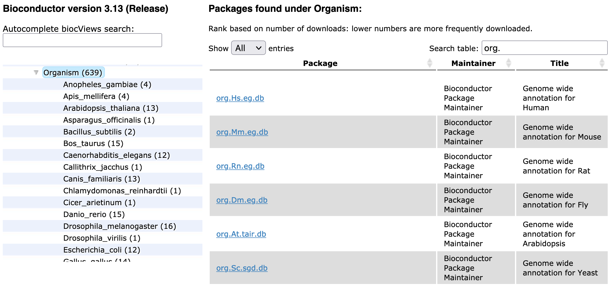

```{r setup,echo=FALSE,results="hide"}
options(width=100)
suppressMessages({
suppressPackageStartupMessages({
library(AnnotationHub)
library(GO.db)
library(dplyr)
library(org.Hs.eg.db)
})
})
```

# Introduction

Gene Ontology reaches into Bioconductor in many ways.  This
vignette sketches the key resources and connections.

# GO.db

[`GO.db`](https://bioconductor.org/packages/GO.db/) is an *annotation package* used through an
R API defined in `AnnotationDbi`.  The package is installable using `BiocManager::install`.

## The basic R API

Here is how we can acquire some tags and the associated terms.

```{r lkgo}
library(GO.db)
GO.db
lk = keys(GO.db)[1:10]
lk
tt = AnnotationDbi::select(GO.db, keys=lk, columns="TERM")
tt
```

## Relationships

```{r other}
ls("package:GO.db")
```

The GO{BP,MF,CC}\* entities listed here are special R environments that
can be queried.

```{r demobp}
get("GO:0000012", GOBPCHILDREN)
```

The recorded relationships for BP terms are:

```{r lkrr}
kk = keys(GO.db)
allc = mget(kk, GOBPCHILDREN, ifnotfound=NA)
table(unlist(sapply(allc, names)))
```

For other subontologies:

```{r lkoth}
allm = mget(kk, GOMFCHILDREN, ifnotfound=NA)
table(unlist(sapply(allm, names)))
allcc = mget(kk, GOCCCHILDREN, ifnotfound=NA)
table(unlist(sapply(allcc, names)))
```

## Dependent packages

Bioconductor software packages that use `GO.db` are:


# OrgDb packages -- mapping GO to genes via NCBI

[`org.Hs.eg.db`](https://bioconductor.org/packages/GO.db/) is a package that
uses NCBI mappings between human genes and GO terms to help annotate genes.
Here, we use it to obtain all genes directly annotated to a GO term.

```{r lkor}
library(org.Hs.eg.db)
library(dplyr)
syms = AnnotationDbi::select(org.Hs.eg.db, keys=lk, keytype="GO", columns="SYMBOL")
head(left_join(mutate(tt, GO=GOID), syms, by="GO"),15)
```

To obtain all genes annotated to a GO term OR TO ONE OF ITS CHILD NODES in the 
GO ontology:

```{r goall}
syms.all = AnnotationDbi::select(org.Hs.eg.db, keys=lk, keytype="GOALL", columns="SYMBOL")
head(left_join(mutate(tt, GOALL=GOID), syms.all, by="GOALL"),15)
```

Gene to GO mappings can be obtained in a similar fashion also for other model organisms:
 


OrgDb annotation objects for non-model organisms can be obtained via 
[AnnotationHub](https://bioconductor.org/packages/AnnotationHub).

```{r ahub}
ah <- AnnotationHub::AnnotationHub()
AnnotationHub::query(ah, "OrgDb")
```

# biocView: GO used for 73 packages in Bioc 3.13

Bioconductor package contributors are required to provide tags for
their packages derived from a vocabulary called `biocViews`.  "GO" is
a tag and 73 packages in Bioconductor 3.13 use it to describe their objective.


Filter the landing pages for Bioc 3.13 packages self-describing with the 'GO' tag 
[here](https://bioconductor.org/packages/3.13/BiocViews.html#___GO).

For Bioconductor 3.14 packages in development, see 
[here](https://bioconductor.org/packages/3.14/BiocViews.html#___GO).

# GO enrichment analysis

A popular use case for GO annotations is GO enrichment analysis.
A variety of methods are available in Bioconductor for that purpose, and can
typically be divided into (i) methods that treat GO annotations as gene sets,
and (ii) methods that account for the topology of the GO graph.

## Methods that treat GO annotations as gene sets 

Among the most used representatives of this class of methods are

- `limma::goana` which performs classic over-representation analysis using
   a hypergeometric test as originally developed for the analysis of microarray data, and
- [GOSeq](https://bioconductor.org/packages/goseq) which conducts enrichment
  testing of GO terms while adjusting for gene length bias in RNA-seq data.

## Methods that account for the topology of the GO graph

Among the most used representatives of this class of methods are

- [GOstats](https://bioconductor.org/packages/GOstats) which performs a
  hypergeometric test that optionally conditions on the GO structure, and
- [topGO](https://bioconductor.org/packages/topGO) which implements different
  approaches (elim, weight, and parentchild) to reduce redundancy resulting
  from genes being annotated along the parent-child hierarchy.   

# Benchmarking of methods for GO enrichment analysis

The [GSEABenchmarkeR](https://bioconductor.org/packages/GSEABenchmarkeR) package
ships disease relevance scores for GO-BP and GO-MF terms. These relevance scores
are aggregated per-gene disease relevance scores as obtained from the
[MalaCards](https://www.malacards.org/) database.
This establishes some ground truth in a benchmarking setup, 
indicating which GO terms are considered relevant for a certain disease.

As an example, we inspect relevance scores of certain GO-BP terms for breast cancer:

```{r mala}
data.dir <- system.file("extdata", package="GSEABenchmarkeR")
mala.gobp.file <- file.path(data.dir, "malacards", "GO_BP.rds")
mala.gobp <- readRDS(mala.gobp.file)
head(as.data.frame(mala.gobp$BRCA))
```

# Session info

```{r lksess}
sessionInfo()
```
