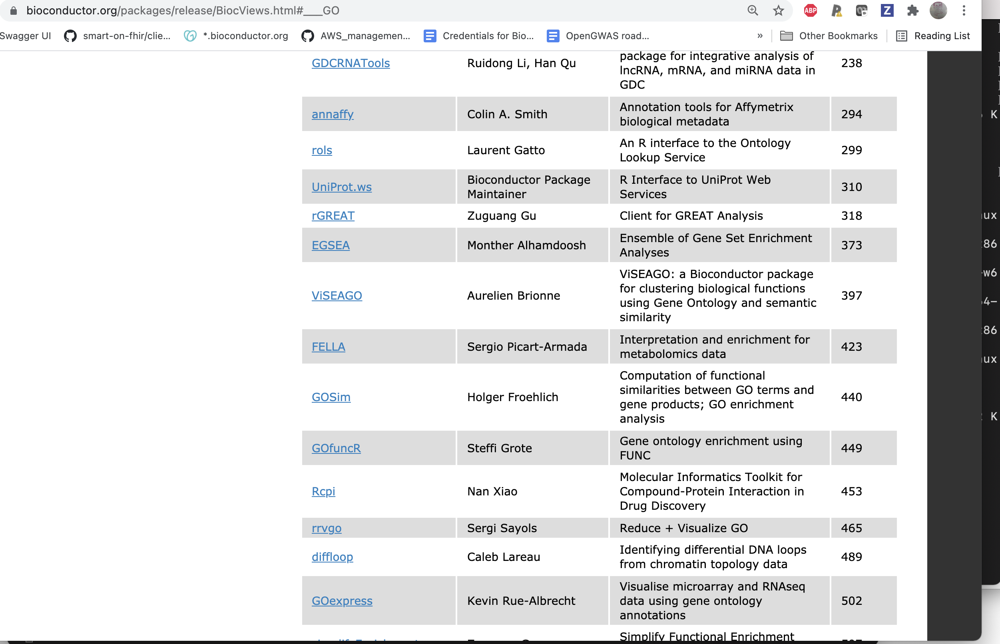

```{r setup,echo=FALSE,results="hide"}
options(width=100)
suppressMessages({
suppressPackageStartupMessages({
library(GO.db)
library(dplyr)
library(org.Hs.eg.db)
})
})
```

# Introduction

Gene Ontology reaches into Bioconductor in many ways.  This
vignette sketches the key resources and connections.

# GO.db

[`GO.db`](https://bioconductor.org/packages/GO.db/) is an *annotation package* used through an
R API defined in `AnnotationDbi`.  The package is installable using `BiocManager::install`.

## The basic R API


Here is how we can acquire some tags and the associated terms.

```{r lkgo}
library(GO.db)
GO.db
lk = keys(GO.db)[1:10]
lk
tt = AnnotationDbi::select(GO.db, keys=lk, columns="TERM")
tt
```

## "Relationships"

```{r other}
ls("package:GO.db")
```

The GO{BP,MF,CC}* entities listed here are special R environments that
can be queried.

```{r demobp}
get("GO:0000012", GOBPCHILDREN)
```

The recorded relationships for BP terms are:

```{r lkrr}
kk = keys(GO.db)
allc = mget(kk, GOBPCHILDREN, ifnotfound=NA)
table(unlist(sapply(allc, names)))
```

For other subontologies:

```{r lkoth}
allm = mget(kk, GOMFCHILDREN, ifnotfound=NA)
table(unlist(sapply(allm, names)))
allcc = mget(kk, GOCCCHILDREN, ifnotfound=NA)
table(unlist(sapply(allcc, names)))
```

## Dependent packages

Bioconductor software packages that use `GO.db` are:


# org.Hs.eg.db -- mapping GO to genes via NCBI

[`org.Hs.eg.db`](https://bioconductor.org/packages/GO.db/) is a package that
uses NCBI mappings between genes and GO terms to help annotate genes.

```{r lkor}
library(org.Hs.eg.db)
library(dplyr)
syms = AnnotationDbi::select(org.Hs.eg.db, keys=lk, keytype="GO", columns="SYMBOL")
head(left_join(mutate(tt, GO=GOID), syms, by="GO"),15)
```

# biocView: GO used for 73 packages in Bioc 3.13

Bioconductor package contributors are required to provide tags for
their packages derived from a vocabulary called `biocViews`.  "GO" is
a tag and 73 packages in Bioconductor 3.13 use it to describe their objective.



Filter the landing pages for Bioc 3.13 packages self-describing with the 'GO' tag <a href="https://bioconductor.org/packages/3.13/BiocViews.html#___GO" target="_blank">here</a>.

For Bioconductor 3.14 packages in development, see <a href="https://bioconductor.org/packages/3.14/BiocViews.html#___GO" target="_blank"><here</a>.


# Session info

```{r lksess}
sessionInfo()
```
